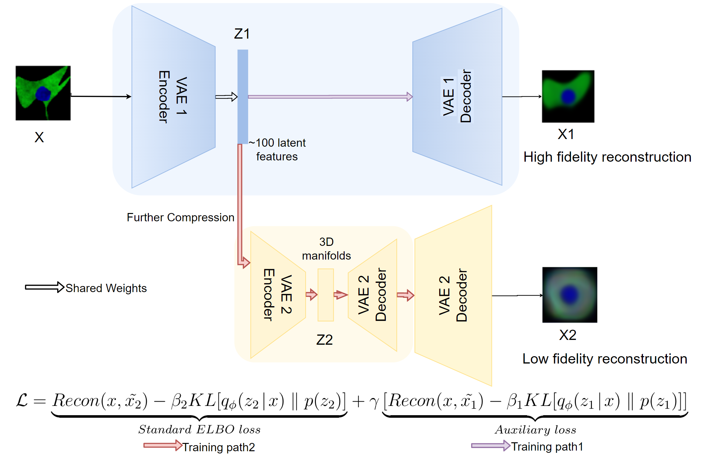
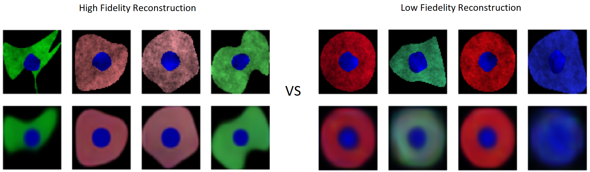

# 2020-09-04 Meeting

## 1. Two stage VAE [finished]

### The work flow of 2 stage VAE

In training 2 stage VAE, both VAE1 and VAE2 are jointly combined as a single model. The cell image flow throughout the VAE1 Encoder to obtain an approximately **100** latent features. These features are passed to **_VAE1 Decoder(blue)_** for **reconstruction(purple arrow)**and **_VAE2 Encoder(Yellow)_** for further **compression (red arrow)**. The **_VAE1 Decoder_** reconstruct images(**X1**) from 100 latent features. Concurrently, the **_VAE2_** with an **_additional Decoder 2(Yellow)_** transforms the 100 features to 3d manifolds and reconstruct (**X2**) to approximate **X**.

The loss of each training path is computed **independently** by their reconstruction loss and KL divergence to the prior, and the **joint loss** is combined by these two ELBO loss with an **auxiliary weight** for VAE1 loss. The gamma parameter shown in the equation is the weight of auxiliary loss.

### Training result

- Epoch: 50
- Batch_size: 32
- Input_size: 3 _ 64 _ 64
- Dataset: Synthetic BBBC031
- Ground Truth: 7 phenotypic processes

As observed in the loss graph above, the 2 stage VAE is **converging** as expected.

**_High fidelity reconstruction_**, derived using 100 learned features in the left of Fig shown. It is obvious that the **shape** and **colour** of the images are learned well, the reconstructed images are very similar to the raw cell images. The **_Low fidelity reconstruction_** on the other hand, cannot capture the share appropriately, the reconstructed features only obtain a **rounded shape**. This is due to the **information loss** during dimension reduction.

Similarly, the generated images from 100 latent features (**left**) and 3d manifolds (**right**) also emphasizes this hypothesis. As cells of different shapes can be produced by inferencing from 100 latent features.

In short, the 2 stage is built appropriately and performing as expected.

## 2. The human guidance [working on]

Discussed with Sacha. Working on the code and learning the dataset.

## 3. Timeline and plan

- Prepare weekly meeting and reports in PDF.

- Two stage VAE: Add **mutual information penalty terms**. It is expected to be finished <u>before the end of the holiday</u> (14/09/2020). Another long-term objective is to <u>train</u> the model intensively and <u>tuning parameters</u> to obtain optimal results. This is expected to be completed by the end of Thesis B.

- Human Guidance: Getting familiar with the **_dataset_**. Working concurrently with VAE to incorporate the user **_feedback constraint_** to the objective function.

- **Research Literatures**:

  - Focus on interpretability and XAI
  - Research in context to incorporate a more complex inference in VAE. As well as allow some extent supervision in VAE training (**semi-supervised**).

- My Workload

  - During holiday (before 14/09/2020):

    Another ongoing research project need to be present every Tuesday, hence from Saturday to Tuesday I will be working on that.

    The allocated time for me to work on thesis project is from Tuesday afternoon to Friday afternoon (full time ??).

  - Term 3 (Thesis B):

    Since I have 2 courses and another research projects inT3, I will allocate approximate 10 - 12 hrs or two nights per week for doing thesis.

## Meeting Notes: [raised during the meeting]

1. More insights of the **unit and scale** of the VAE loss. e.g. what does 10000 in VAE loss mean, and is it considered large or small

2. Discuss the **feedback** from Sacha's thesis defence with **John** next week

3. The **_inference_** model in VAE is a single gaussian model. Can we incorporate **Gaussian Mixture Model(GMM)** and the ground truth(**GT**) to derive more robust distributions.

4. How to retrain the whole NN after received **human guidance**, user can interact with multiple points and give feedback at once. Then the feedback provided can be continuously trained with this model (**not from scratch**).

   How many more training epochs are needed for the models to comply the feedback?

5. prior analysis e.g. unsupervised clustering
6. drug shifted the balance of the cell population, cell popu sorted more discrete
