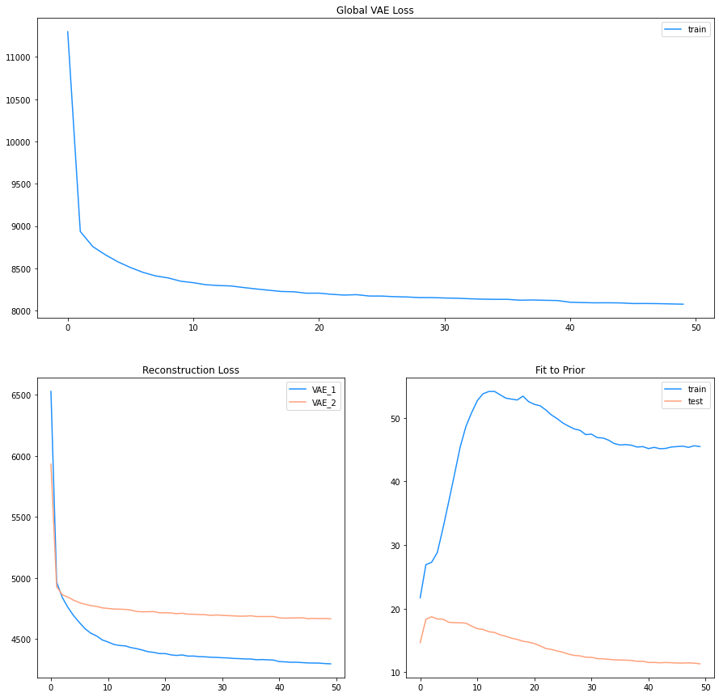
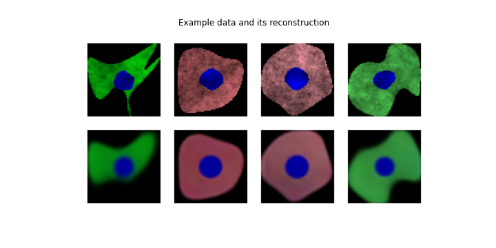
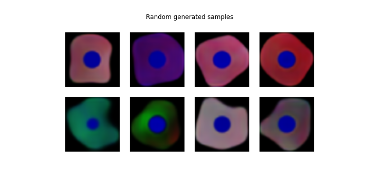
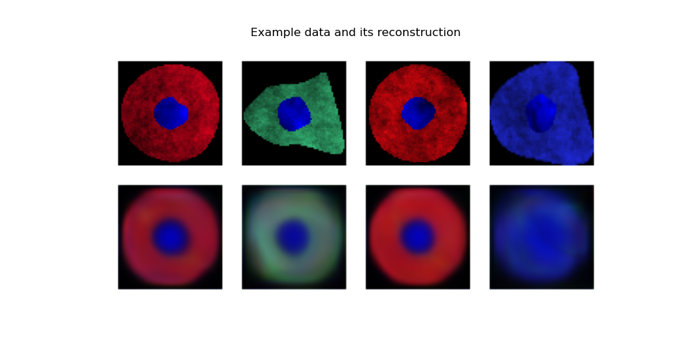
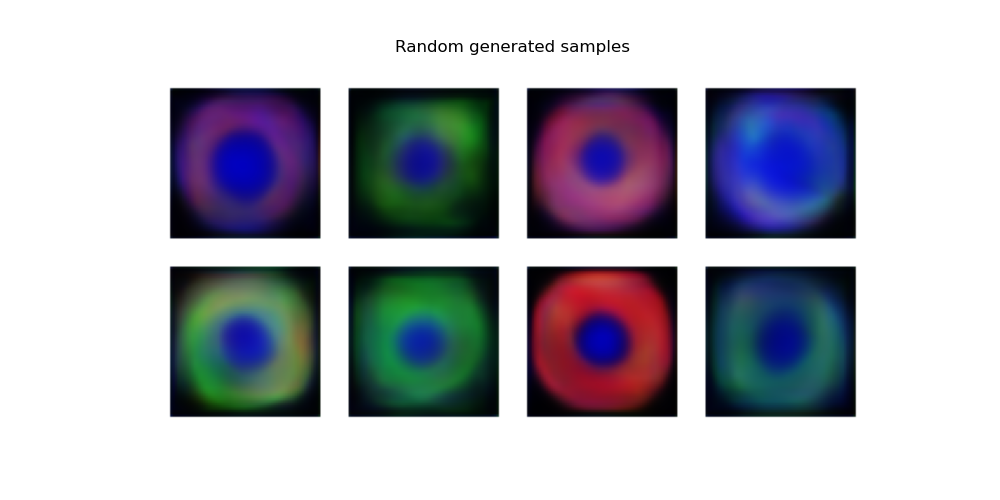

# 2020-09-04

## 1. Two stage VAE finished, where we can train both at the same time.
<!-- Illustration of the model workflow -->
### - training result 
<!--- Loss = Recon(x , x_2) - \beta_2KL(q_\phi(z_2 | x) || p(z_2)) + \gamma[Recon(x, x_1) - \beta_1KL(q_\phi(z_1 | x) || p(z_1)] --->
loss_overall = loss_VAE_2 + gamma * loss_VAE_1
> - Epoch: 50
> - Batch_size: 32
> - Dataset: Synthetic BBBC031
> - train_size: 90%

High fiedality reconstruction, generation using 100 featurs(high fidelity), it captures the shape.

However, **Compare to low fiedality generations from the 3D space manifold**

## 2. The human guidance
we shuld change it to close to a specific cluster. For example, 