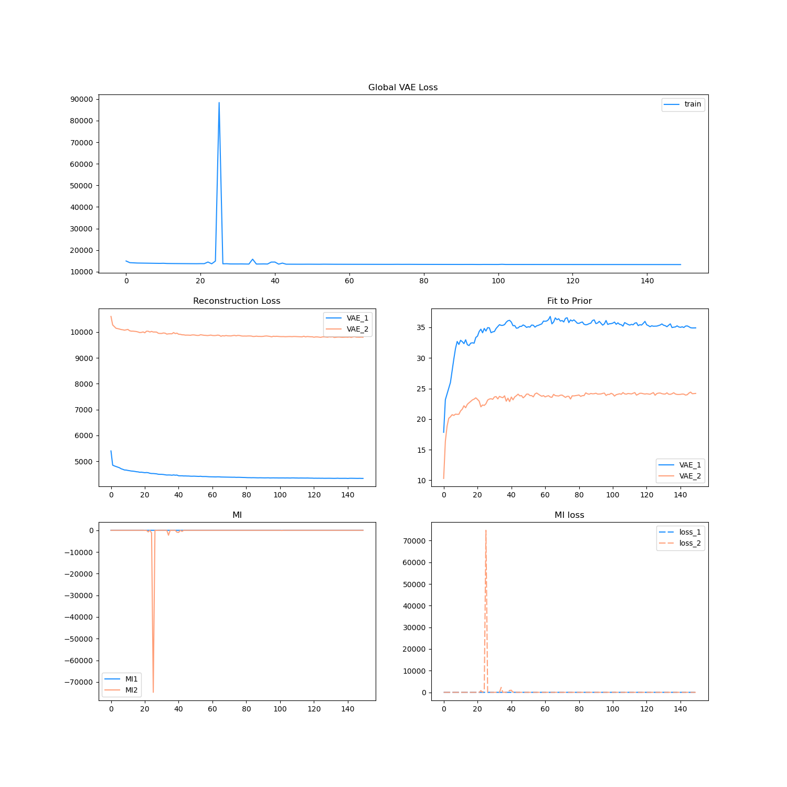

# 2020-09-11 Meeting

## Previous Questions and Plan

what the loss represents

*formula*

reconstruction_loss = MSE(reconstructed_image, image)
compression and inference loss = weight_coef  *  KL Divergence(latent, unit_gaussian)

## 1. Two stage infoMaxVAE [finished]

**Objective function:**

**Flow chart**: 

Training process is very unstable unstable: 

**VAE1** high fidelity reconstruction:

**VAE2** low fidelity reconstruction collapsed: 

## 2. Research Literatures

- ***Explanation by progressive exaggeration ICLR 2020:***   

> 
>
> **Key idea:** propose a architecture $f(x)$ with a perturbation $\delta$ to the output $f(x) + \delta$ to $f(x_\delta)$ 
>
> **Gradual perturbations**
>
> 1. Consistency: perturbed samples generated by latent representations should lie on the distribution (data manifold). By comparing the raw and reconstructed images.  
>
> 2.  d
>
> 3. Identity preservation:
>
>    latent space closeness 
>
>    cosine similarity of generated and real image. Critical score in percentage is ***0.5***.
>
>    
>
>     
>
> On Medical Imaging (X-ray)
>
>  		
>
> 
>
> **Gradient-based Saliency Map**
>
> 
>
> Introduced before in the [CNN explainer](https://poloclub.github.io/cnn-explainer/). It is generated by use the two extreme value of the data boundary and the **difference** is the saliency map. 
>
> We can progressively replace a percentage of the most relevant pixels in an image (as given by the saliency map) with random values sampled from a uniform distribution. If each alteration of the feature resulting a drop in mutual information or some similar evaluation metrics (accuracy), then it can be ensured that  
>
> **Bias Detection**
>
> On multiple features on bias and unbiased 
>
>  
>
> The top biased classifier whose data distribution is confounded with Gender. The top label indicates output of the classifier and the bottom label is the output of an oracle classifier for the con-founding attribute gender. 
>
> Need to read thoroughly to gain deepen understanding. 
>
> VAE construct blurry image compare to GAN.

- ***GMM and VAE***

> In progress, 
>
> 

## 3. Meeting with John on Tuesday

1. Measure the MSE loss (recon) of individual channels between reconstructed and images.
2. 

## 4. The human guidance [VAE 2]

Having trouble understanding some of the programming details.

## Plan 

- Compare ***Explanation by progressive exaggeration ICLR 2020*** with 77 pages paper 
- Fix the 
- Upload 

## Meeting Notes:

- 