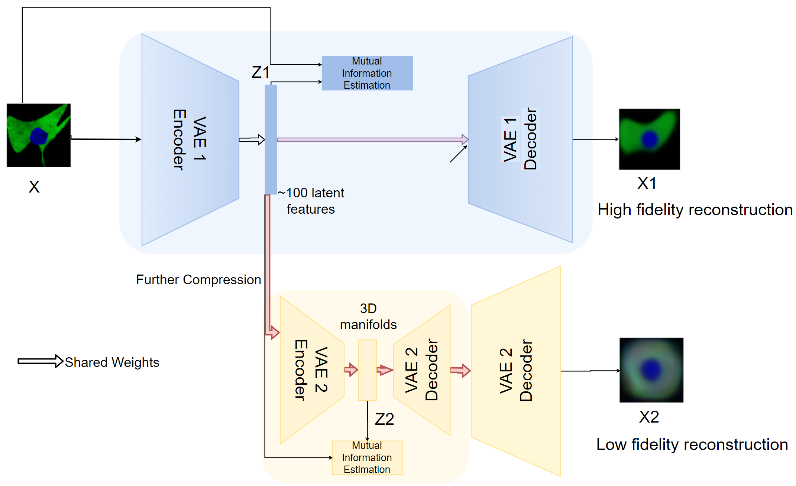
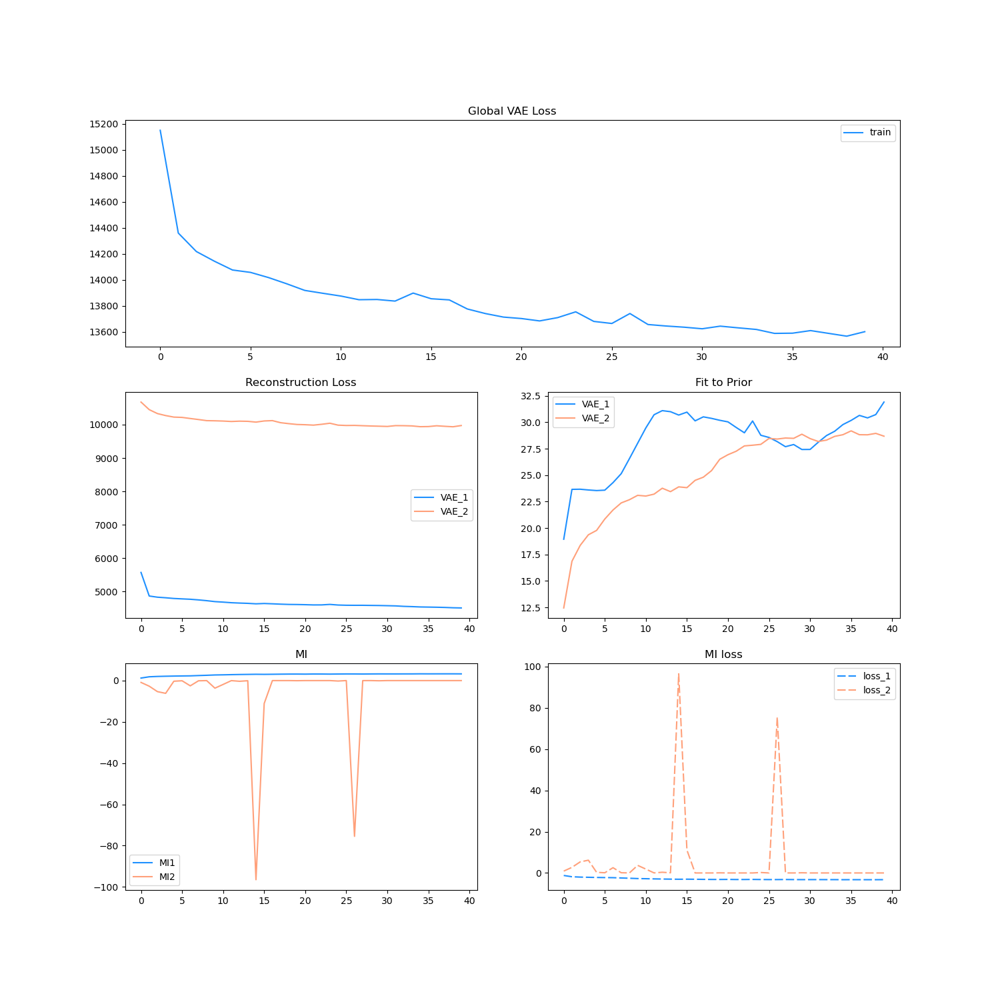
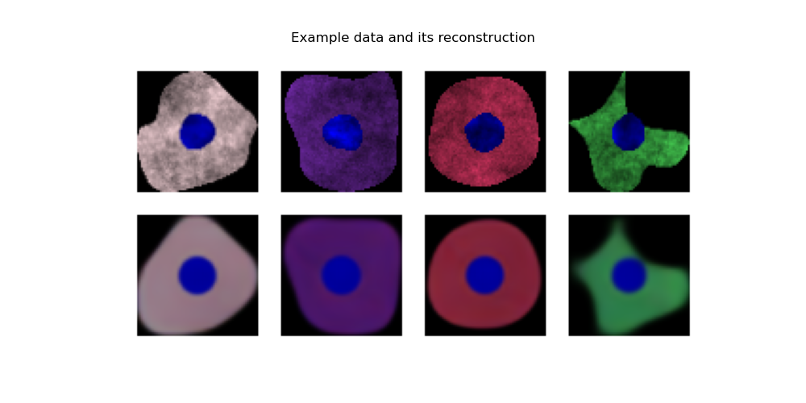
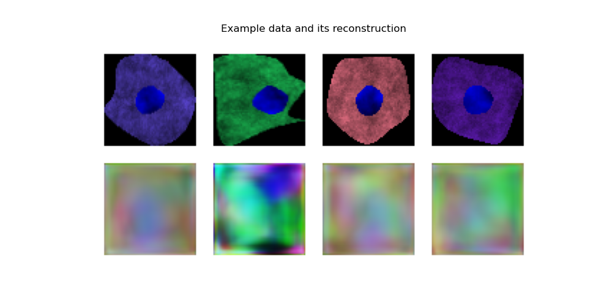
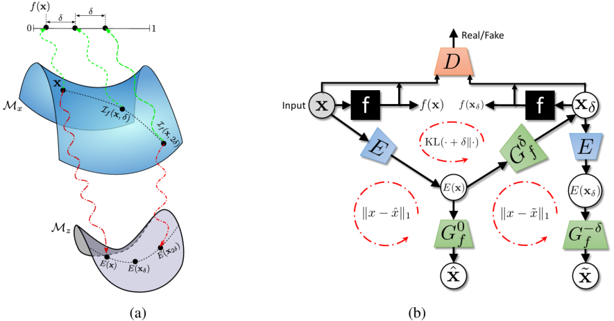
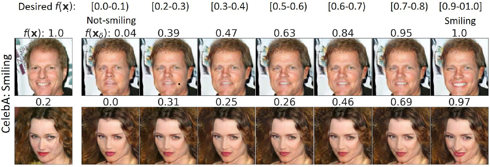
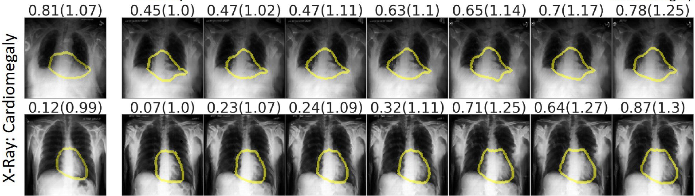
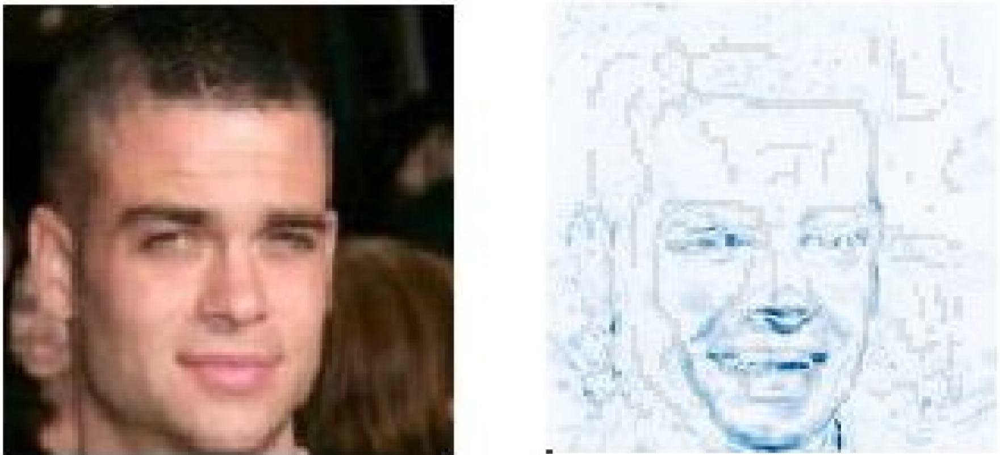
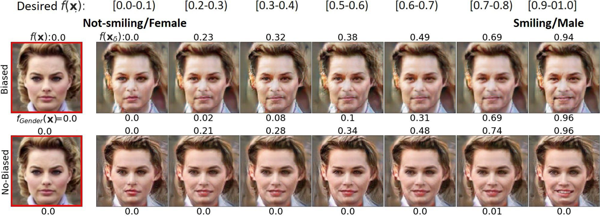

# 2020-09-11 Meeting

## 1. Two stage InfoMax-VAE

**Updated System Architecture**:

 

**Objective function:**

$$L(\theta_1, \phi_1, \theta_2, \phi_2) = (ReconLoss(x, x_2) - \beta_2 * KL(x, z_2) + \alpha_2 * MI(x, z_2)) + \gamma * (ReconLoss(x, x_1) \\ - \beta_1 * KL(x, z_1) + \alpha_1 * MI(x, z_1))$$

Training process is very unstable: 

**VAE1** high fidelity reconstruction:

**VAE2** low fidelity reconstruction collapsed: 

## 2. Research Literatures

- ***Explanation by progressive exaggeration ICLR 2020:***   

> 
>
> **Key idea:** Use an generative explaining function $I_f(x)$ to perturbs prediction from a supervised model, $f(x) + \delta$, to traverse the prediction space to each end of the binary classification. Each step $\delta$ changes the posterior probability of previous step. 
>
> **Definition:** 
>
> - An ***Encoder***  $E: M_x \rightarrow M_z$ and a conditional ***Generator*** $G: M_z \rightarrow M_x$ 
>
> - Divide the posterior probability range ([0, 1]) into $\frac{1}{\delta}$ equally-sized steps. 
>
> -  Condition **$c$**: allows the incorporation of a context as a condition. $f(x) + \delta$ as changing index from 
>   $$
>   c_f(x, 0) \rightarrow c_f(x, 1) \dots \rightarrow c_f(x, \delta)
>   $$
>   each returning the step index.
>
>    -    $I_f(x, \delta) = G(E(x), c_f(x ,\delta))$ to represent the explainer function which generates a perturbed image.

> **Gradual perturbations**
>
> 1. Consistency: perturbed samples generated by latent representations should lie on the distribution (data manifold). By comparing the raw and reconstructed images.  
>
> 2.   Self Consistency: $f(I_f(x, \delta)) -> \delta + f(x)$ 
>
> 3. Identity preservation: $I_f(I_f(x, \delta), -\delta) = x$, the reverse perturbation should bring back x to its original form.
>
>    This is measures by latent space closeness, cosine similarity of generated and real image. Critical score in percentage is ***0.5***.
>
>    
>
>     
>
> On Medical Imaging (X-ray)
>
>  		
>
> 
>
> **Gradient-based Saliency Map**
>
> 
>
> Introduced before in the [CNN explainer](https://poloclub.github.io/cnn-explainer/). It is generated by use the two extreme value of the data boundary and the **difference** is the saliency map. 
>
> We can progressively replace a percentage of the most relevant pixels in an image (as given by the saliency map) with random values sampled from a uniform distribution. If each alteration of the feature resulting a drop in mutual information or some similar evaluation metrics (accuracy), then it can be ensured that  
>
> 
>
> **Bias Detection**
>
> On multiple features on bias and unbiased 
>
>  
>
> The top biased classifier whose data distribution is confounded with Gender. The top label indicates output of the classifier and the bottom label is the output of an oracle classifier for the con-founding attribute gender. 
>
> Need to read thoroughly to gain deepen understanding. 
>
> VAE construct blurry image compare to GAN.

- ***GMM and VAE***

> [Deep Unsupervised Clustering with Gaussian Mixture Variational Autoencoders ICRL 2017]()

## 3. Meeting with John on Tuesday

1. More on prior analysis of VAE, clusters with GMM and known (user specified) **$n$** clusters 
2. ***Channel Level***, Measure the MSE loss (recon) of individual channels between reconstructed and images and the channel-wise dependency.
3. ***Pixel Level***, which pixels are not discriminated. 
4. ***Cell level***, prior analysis. The realistic Chaffer dataset, $C_1$ and $C_2$ 
5. Find out what the MI measures. e.g. scale and etc

## 4. The human guidance [VAE 2]

Having trouble understanding some of the programming details.

## Plan 

- Compare ***Explanation by progressive exaggeration ICLR 2020*** with 77 pages paper 
- Fix the infoVAE2 

## Meeting Notes:

- 