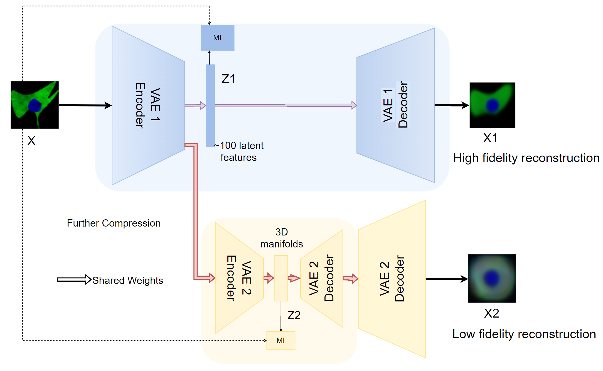
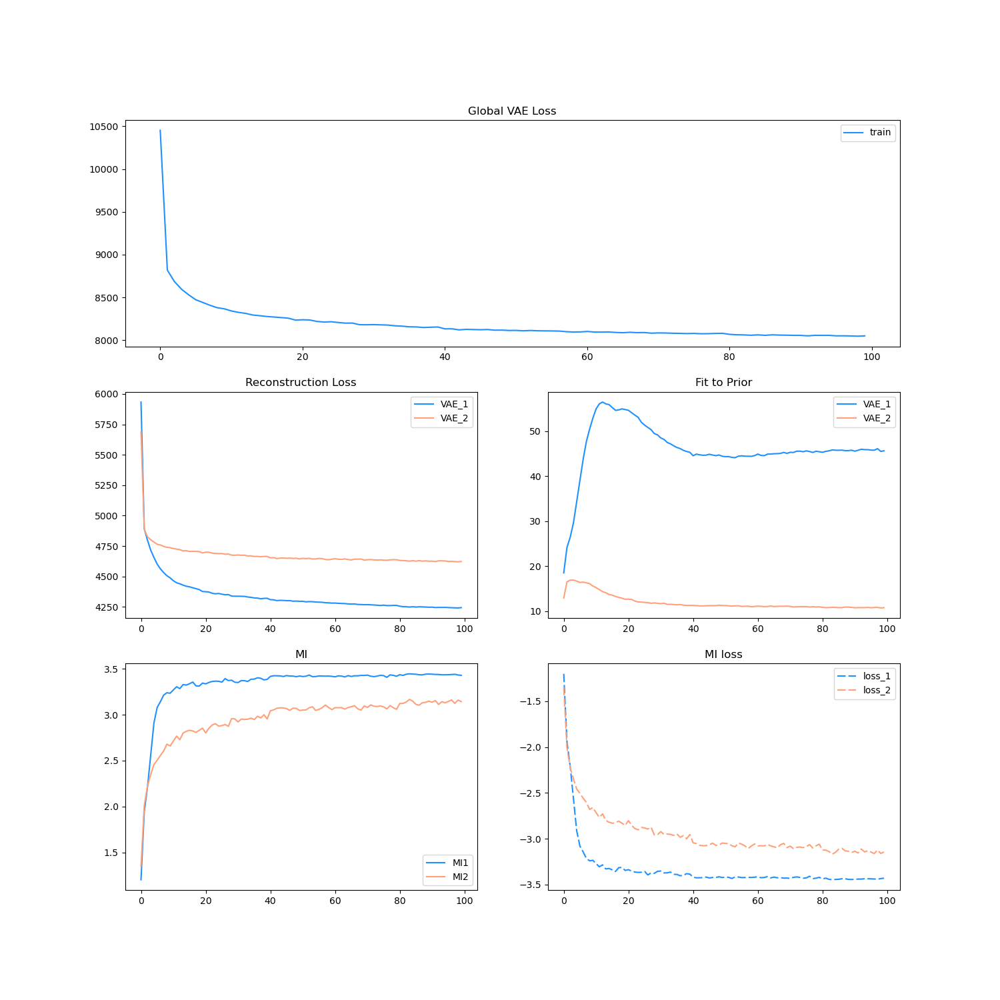
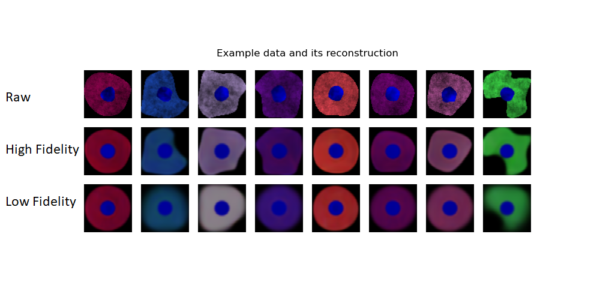
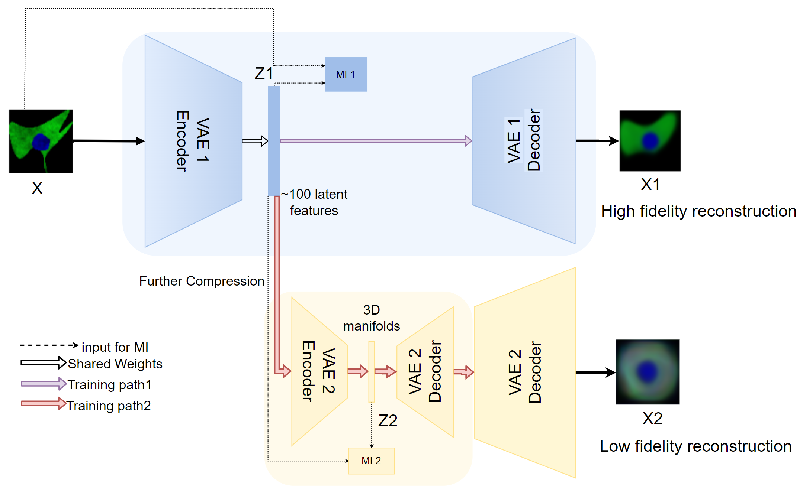
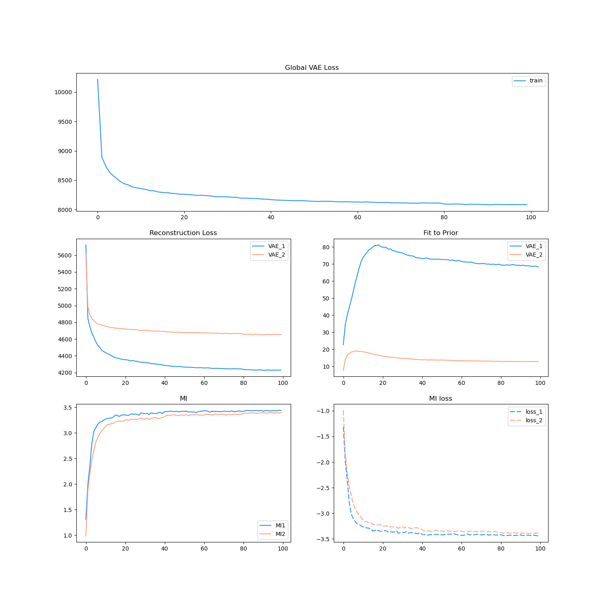
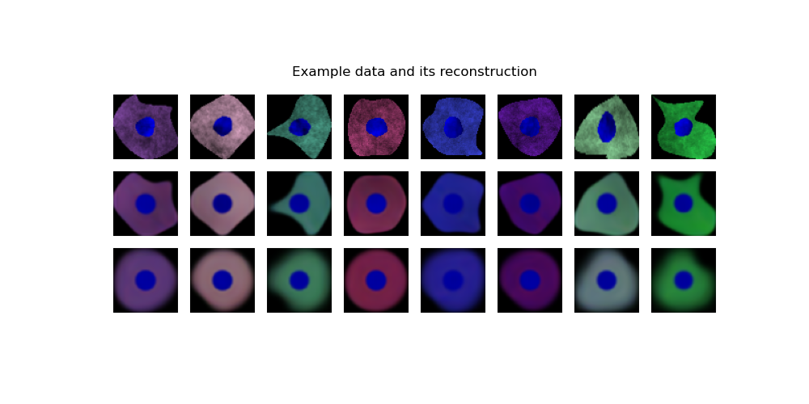
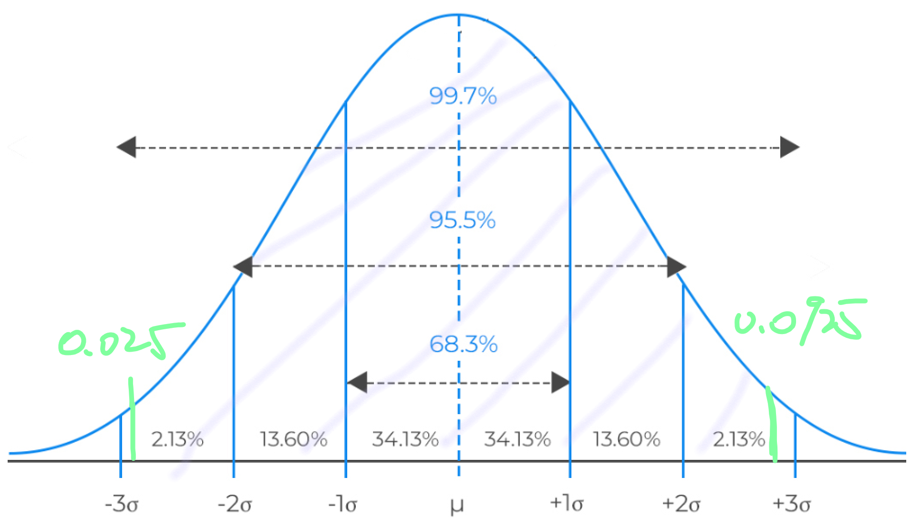
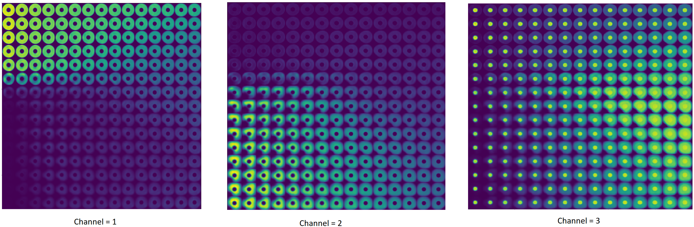
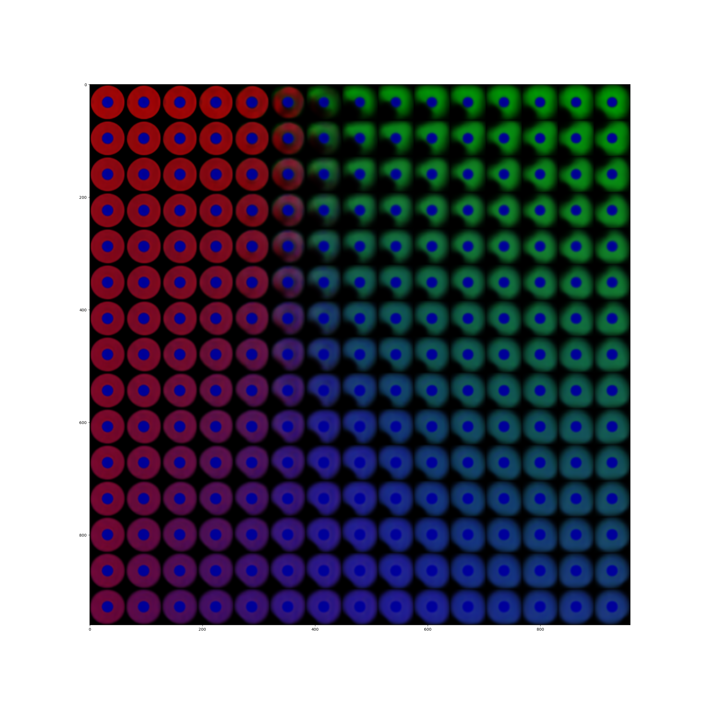
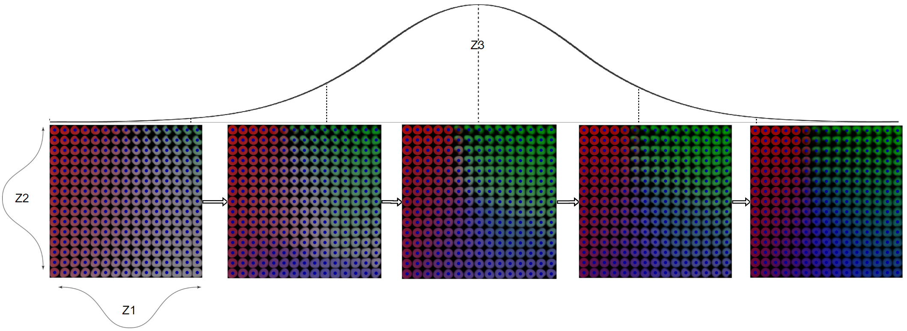

# 2020-09-18 Meeting

**The KL Divergence:**

Approximation in VAE shown in [derivation](https://arxiv.org/pdf/1907.08956.pdf): 
$$
\begin{align*}
KL(q_\theta(z|x_i) || p(z)) &= -\sum_z\frac{1}{2}[1 + \log(\sigma_q^2) -\sigma_q^2 - \mu_q^2 ]
\end{align*}
$$
The difference cannot be evaluated directly from the loss graph. Since the $ReconLoss$, $KL$ and $MI$ are in different scale. 

## 1. Two Stage InfoMax-VAE

Fix the bug of the oscillating loss score of mutual information estimations   

**Hyperparameters**: m=7387, Epoch=150, input=(64, 64, 3), alpha=1, beta =1, gamma=0.8

Derive 2 versions of InfoMax-VAE. 

#### **Ver. 1** Single Embed

For each of the model in 2 stage VAEs, the input image is embedded and sampled only once. The raw cell image is passed through a series of convolutional blocks and linear layers to transform to high-level, low dimensional vectors throughout the`VAE1 Ecoder`. The training path diverges at the end of the VAE1 Encoder. For `VAE1 ` in blue, the compressed image is resampled over Gaussian Distribution to 100 latent features. The `VAE2` take the **high level image data** for further compression throughout `VAE2 Encoder`. Therefore the `MI2` approximate the mutual information between the raw image $X$ and the 3D latent manifolds, shown as $MI(x, z_2)$

Note that we have to still consider the KL loss of reconstruction between $X_2$ and $X$ to update the weight of ***Decoder 2*** properly.
$$
L(\theta_1, \phi_1, \theta_2, \phi_2) = (ReconLoss(x, x_2) - \beta_2 * KL + \alpha_2 * MI(x, z_2)) + \gamma * (ReconLoss(x, x_1) \\ - \beta_1 * KL + \alpha_1 * MI(x, z_1))
$$

##### Training and Results

#### **Ver. 2 Double Embed**

In the **Ver. 2** of the 2 stage VAE, the training path diverges after inferencing 100 latent features. Then the `VAE2` takes the 100 latent feature vectors as input for further compression and eventually sampled to a 3D manifolds.

at the end of the VAE1 Encoder. For `VAE1 ` in blue, the compressed image is resampled over Gaussian Distribution to 100 latent features. The `VAE2` take the **high level image data** for further compression throughout `VAE2 Encoder`. Therefore the `MI2` approximate the mutual information between the first embeded 100 features and the second embeded 3d features, shown as $MI(z_1, z_2)$. 

$$
L = (ReconLoss(x, x_2) - \beta_2 * KL + \alpha_2 * MI(x, z_2)) + \gamma * (ReconLoss(x, x_1) \\ - \beta_1 * KL + \alpha_1 * MI(x, z_1))
$$

##### Training and Results

The VAE1 has fitted better to the prior. Since it measures the MI between z1 and z2, it is expected to see a very close curves. 

#### Results and Conclusion

In summary, both version of two stage infomax-VAE is converging. We can therefore compare their behaviour on image reconstruction between the `Vanilla VAE` (Shown in previous meeting) and ` InfoMax VAE`. 

Qualitatively, we cannot draw important conclusions from their image reconstruction behaviour. A strong support from effective **quantitative evaluations** are required. 

Note that since the ***objective function*** for each of the architectures is different, therefore it is not valid to compare their loss graphs directly since they have different scale. However, we can still compare their reconstruction loss.

#### **TODOs**

> - Apply a beta larger than 1 ($\beta$-VAE)
> - Apply different value of $\gamma$ for $MI$
>
> - Find out how MINE is approximated

## 2. Inference and Explanation 

Since the prior of the latent space of VAE is Gaussian.

We permutate uniformly (n=15) across the data distribution (95%) of the 3 latent feature ($i, j, k$). With each step $\delta$ approach from one end to another. However, we can only model 2 features on a graph at a time.

#### **Individual channels**

In the graph shown above, each axis represent a feature permutating throughout the distribution. Note that the the **vertical** feature in **channel 3** in the first column has shown some controls over the nucleus of the cell.

#### RGB

As shown below, the z3 dimension of the latent feature has contributed to the green and blue colour of cell images.

**TODOs**

> - Incorporate with the grand truth label (class=1, 2, 3, 4) and **conditional-VAE**. We can exaggerate the effect of each perturbation. 

## Plan 

- More insight with perturbation.
- Compare ***Explanation by progressive exaggeration ICLR 2020*** with 77 pages paper 
- Hyperparameter Tuning with $\alpha, \beta, \gamma$. 

## Meeting Notes:

- Is it possible to assess, is that recon() for each latent space model strong or weak, individual divergence per input point, quality of the fit 

- The comparison of generated images dsn't mean loss of information, nice to show, however, cannot draw important conclusion from this 

  need strong support from quantitative metrics. 

- Check local **neighbourhood preservation** (from Sacha's paper), which part of the manifold, map diff GT and 

- The channel from BBBC has RGB channels, try another datasets, 

