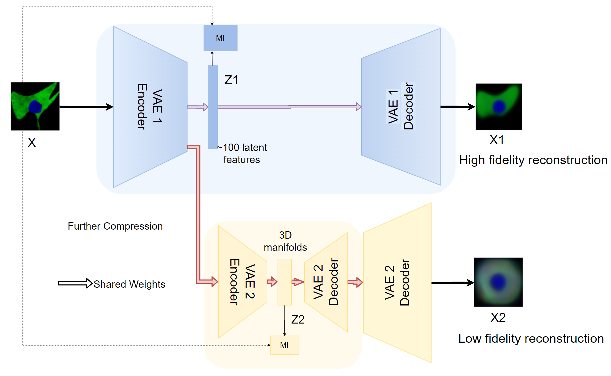
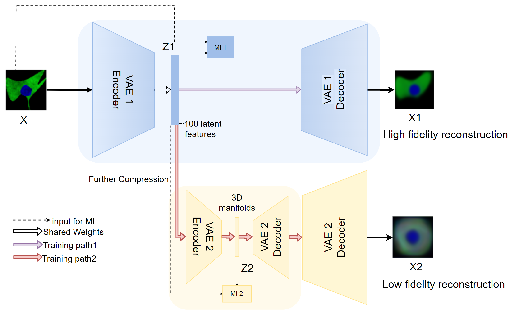

# 2020-09-18 Meeting

## 1. Two Stage InfoMax-VAE

Fix the bug of the oscillating loss score for of input image x and  

**Compare the result**:

Hyperparameters: m=7387, Epoch=40

**The Mutual Information Estimation:** 

**The KL Divergence:**

Approximation in VAE shown in [derivation](https://arxiv.org/pdf/1907.08956.pdf): 
$$
\begin{align*}
D_KL(q_\theta(z|x_i) || p(z)) &= -\sum_z\frac{1}{2}[1 + \log(\sigma_q^2) -\sigma_q^2 - \mu_q^2 ]
\end{align*}
$$
The difference cannot be evaluated directly from the loss graph. Since they have different terms. 

#### **Ver. 1**

Note that we have to still consider the KL loss of reconstruction between $X_2$ and $X$ to update the weight of ***Decoder 2*** properly.

#### **Ver. 2 Double Embed**

***Compare with the 2 stage VAE***

## 2. sda

