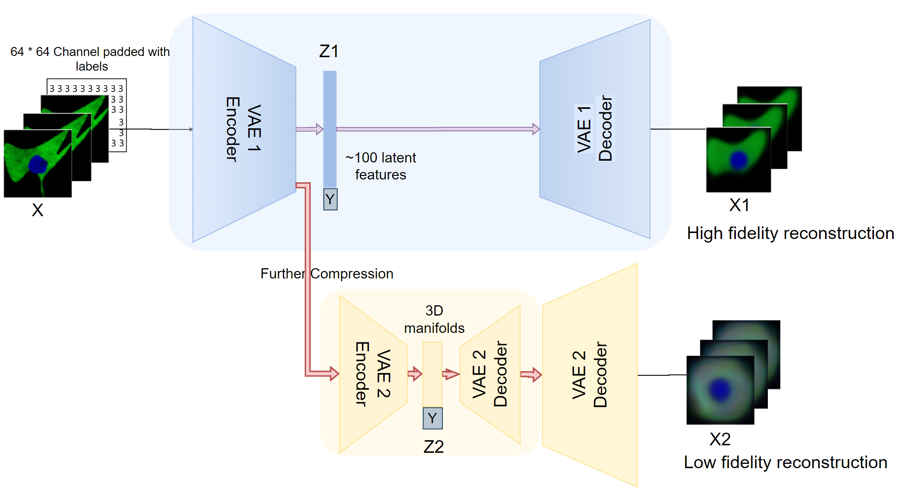

# 2020-09-25

# Model

## Updates to two Stage VAE

1. Added test dataset for accurate quantitative evaluation later.
2. Hyper-parameter training on the weight of  

## Conditional VAE 

**Sources:** [cVAE](https://wiseodd.github.io/techblog/2016/12/17/conditional-vae/)

## Visualization of latent space

### Linear interpolation in image space

**Qualitative Analysis**

**Quantitative Analysis** 

